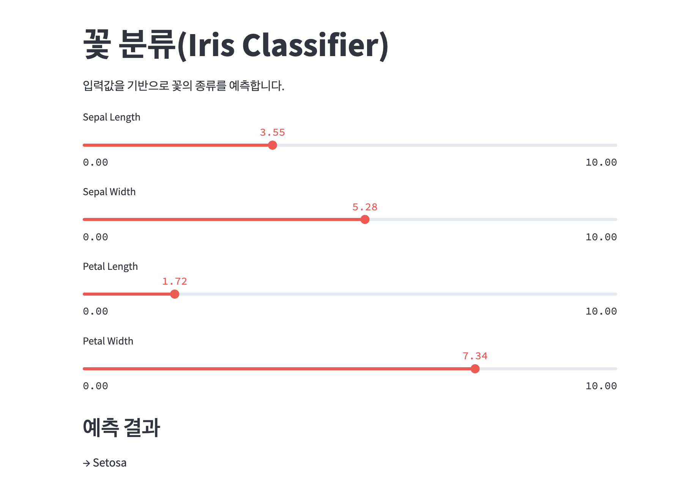

# Iris Classifier: 꽃 품종 분류기

이 앱은 유명한 **Iris 데이터셋**을 기반으로, 꽃받침과 꽃잎의 길이/너비를 입력받아 **꽃의 품종**을 예측합니다.  
`RandomForestClassifier`를 사용한 간단한 머신러닝 예제입니다. **Streamlit**을 활용해 웹 UI를 제공합니다.

---

## 📸 앱 데모 화면

> 사용자가 입력한 특성값을 기반으로 **Setosa / Versicolor / Virginica** 중 어떤 품종인지 실시간으로 예측합니다.
